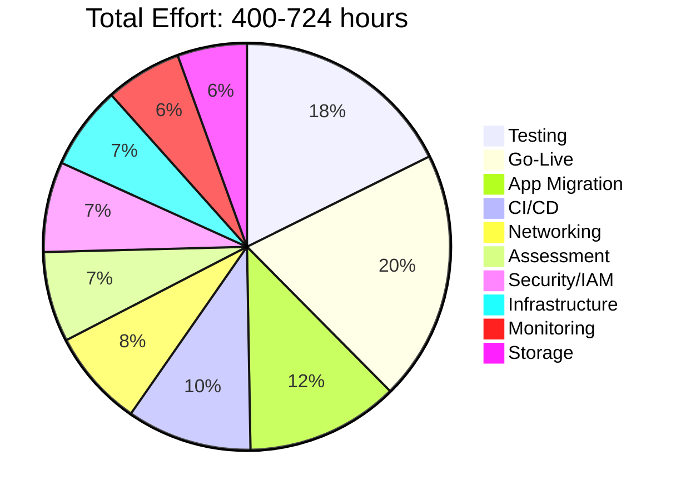
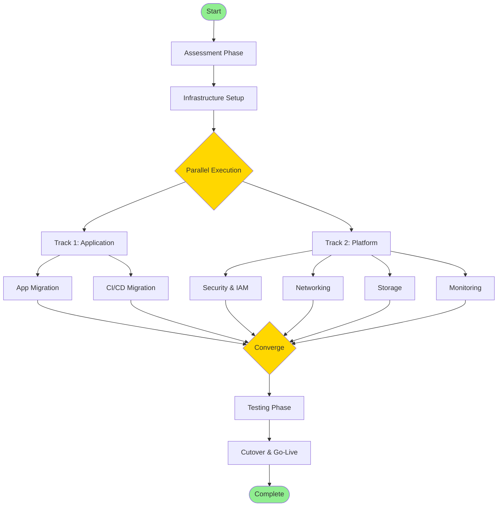

TD
    Start([Start Migration]) --> Phase1[Phase 1: Assessment<br/>32-52 hours]
    
    Phase1 --> P1A[Discovery & Inventory<br/>16-24h]
    Phase1 --> P1B[Complexity Analysis<br/>8-16h]
    Phase1 --> P1C[Dependency Mapping<br/>8-12h]
    
    P1A --> Phase2
    P1B --> Phase2
    P1C --> Phase2
    
    Phase2[Phase 2: Infrastructure Setup<br/>28-48 hours] --> P2A[EKS Cluster Provisioning<br/>8-16h]
    Phase2 --> P2B[AWS Services Config<br/>16-24h]
    Phase2 --> P2C[Add-ons Installation<br/>4-8h]
    
    P2A --> Phase3
    P2B --> Phase3
    P2C --> Phase3
    
    Phase3[Phase 3: Application Migration<br/>48-88 hours] --> P3A[Containerization<br/>24-40h]
    Phase3 --> P3B[Manifest Conversion<br/>16-32h]
    Phase3 --> P3C[Deployment<br/>8-16h]
    
    P3A --> Phase4
    P3B --> Phase4
    P3C --> Phase4
    
    Phase4[Phase 4: Security & IAM<br/>32-52 hours] --> P4A[IAM Roles<br/>16-24h]
    Phase4 --> P4B[RBAC Config<br/>8-16h]
    Phase4 --> P4C[Secrets Migration<br/>8-12h]
    
    P4A --> Phase5
    P4B --> Phase5
    P4C --> Phase5
    
    Phase5[Phase 5: Networking<br/>32-56 hours] --> P5A[Network Policies<br/>8-16h]
    Phase5 --> P5B[Ingress Config<br/>8-16h]
    Phase5 --> P5C[Service Mesh<br/>16-24h]
    
    P5A --> Phase6
    P5B --> Phase6
    P5C --> Phase6
    
    Phase6[Phase 6: Storage<br/>20-40 hours] --> P6A[PV Migration<br/>16-32h]
    Phase6 --> P6B[Storage Class Config<br/>4-8h]
    
    P6A --> Phase7
    P6B --> Phase7
    
    Phase7[Phase 7: CI/CD Migration<br/>40-72 hours] --> P7A[Pipeline Analysis<br/>8-16h]
    Phase7 --> P7B[Pipeline Reconfig<br/>24-40h]
    Phase7 --> P7C[Pipeline Testing<br/>8-16h]
    
    P7A --> Phase8
    P7B --> Phase8
    P7C --> Phase8
    
    Phase8[Phase 8: Monitoring & Logging<br/>24-44 hours] --> P8A[CloudWatch Setup<br/>8-16h]
    Phase8 --> P8B[Logging Config<br/>8-16h]
    Phase8 --> P8C[Alerting Setup<br/>8-12h]
    
    P8A --> Phase9
    P8B --> Phase9
    P8C --> Phase9
    
    Phase9[Phase 9: Testing<br/>72-128 hours] --> P9A[Functional Testing<br/>24-40h]
    Phase9 --> P9B[Performance Testing<br/>16-32h]
    Phase9 --> P9C[Security Testing<br/>16-24h]
    Phase9 --> P9D[UAT<br/>16-32h]
    
    P9A --> Phase10
    P9B --> Phase10
    P9C --> Phase10
    P9D --> Phase10
    
    Phase10[Phase 10: Cutover & Go-Live<br/>72-144 hours] --> P10A[Cutover Planning<br/>8-16h]
    Phase10 --> P10B[Production Migration<br/>16-32h]
    Phase10 --> P10C[Post-Migration Validation<br/>8-16h]
    Phase10 --> P10D[Hypercare Support<br/>40-80h]
    
    P10A --> Complete
    P10B --> Complete
    P10C --> Complete
    P10D --> Complete
    
    Complete([Migration Complete<br/>Total: 400-724 hours])
    
    style Start fill:#90EE90
    style Complete fill:#90EE90
    style Phase1 fill:#FFE4B5
    style Phase2 fill:#FFE4B5
    style Phase3 fill:#FFE4B5
    style Phase4 fill:#FFE4B5
    style Phase5 fill:#FFE4B5
    style Phase6 fill:#FFE4B5
    style Phase7 fill:#FFE4B5
    style Phase8 fill:#FFE4B5
    style Phase9 fill:#FFE4B5
    style Phase10 fill:#FFE4B5
```

## Simplified Linear Flow

```mermaid
flowchart LR
    A[Assessment<br/>32-52h] --> B[Infrastructure<br/>28-48h]
    B --> C[App Migration<br/>48-88h]
    C --> D[Security/IAM<br/>32-52h]
    D --> E[Networking<br/>32-56h]
    E --> F[Storage<br/>20-40h]
    F --> G[CI/CD<br/>40-72h]
    G --> H[Monitoring<br/>24-44h]
    H --> I[Testing<br/>72-128h]
    I --> J[Go-Live<br/>72-144h]
    
    style A fill:#4A90E2,color:#fff
    style B fill:#4A90E2,color:#fff
    style C fill:#4A90E2,color:#fff
    style D fill:#4A90E2,color:#fff
    style E fill:#4A90E2,color:#fff
    style F fill:#4A90E2,color:#fff
    style G fill:#4A90E2,color:#fff
    style H fill:#4A90E2,color:#fff
    style I fill:#4A90E2,color:#fff
    style J fill:#50C878,color:#fff
```



## Effort Distribution



## Parallel Execution Model



## Usage

Copy this entire file to your GitHub repository as `README.md`. The Mermaid diagrams will render automatically on GitHub.

## Total Effort Summary

| Complexity | Hours | Weeks | Team Size |
|-----------|-------|-------|-----------|
| Simple | 400-500 | 10-12.5 | 4-6 |
| Medium | 500-600 | 12.5-15 | 6-8 |
| Complex | 600-724 | 15-18 | 8-10 |
